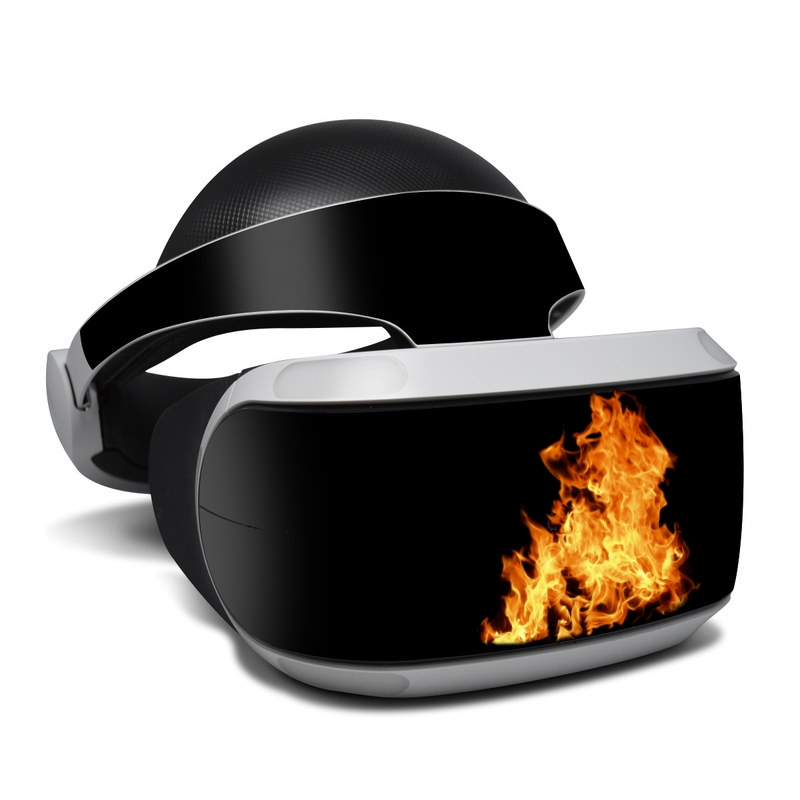

# virtual-emergency

Thick black smoke chokes the city, as fire moves in from the West.  Emergency vehicles race to the fire front, as residents, schools and businesses prepare to evacuate.  As embers begin to fall on the outer suburbs, everyone's next decisions are crucial.

Situational awareness is paramount in dealing with any emergency situation.  Virtual Emergency Management creates a virtual environment that allows an emergency commander to be fully immersed in the situation, through VR, knowing the position of all their resources.  The direction of the wind, and position of emergency vehicles, evacuation centres, potentially threatened lives and infrastructure are all mapped out in three dimensions.  They are aware of it all.

In the city, evacuations are coordinated flawlessly to available schools.  The emergency vehicles a directed in the optimal plan to stop the fire, keeping a constant supply of water.  Although some houses could not be saved at the city's periphery, no lives are lost.
